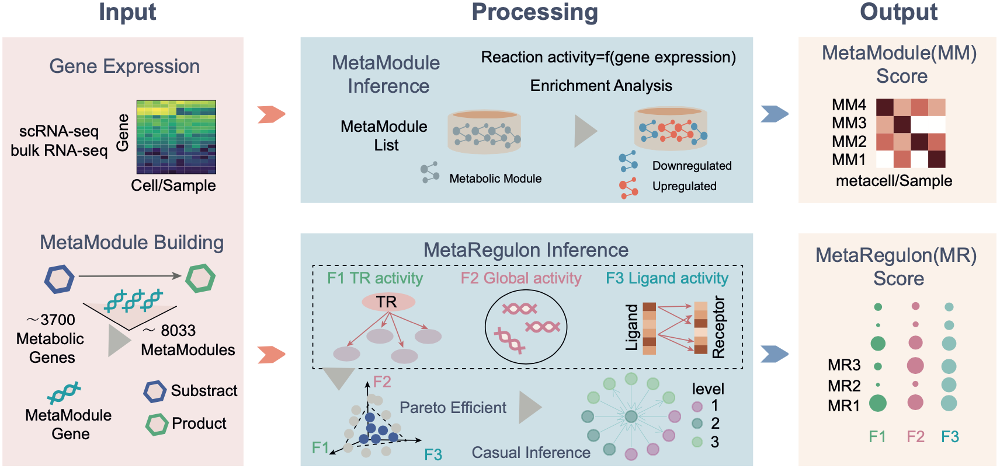

# MetroSCREEN


Metabolite and their associated extrinsic and intrinsic regulators screening based on transcriptomic data.

MetroSCREEN is a computational tool designed to deduce metabolic states (MetaModule function) and identify upstream extrinsic and intrinsic regulators (MetaRegulon function) that influence dysregulated metabolic reactions, utilizing either scRNA-seq or bulk data.



## Change Log
### v0.0.1a
* Build MetroSCREEN.
### v1.0.0
* Release MetroSCREEN.


## Install MetroSCREEN
```bash
conda install tangke::metroscreen
```
## Installation of Other Dependencies
Install the dplyr package using install.packages('dplyr').
For single cell data analysis, we provide pipeline to work with Seurat(Seurat V4). Please install Seurat package by install.packages('Seurat').

## Documentation
For full installation and usage of MetroSCREEN, please refer to the [documentation](https://metroscreen-rtd-rutorial.readthedocs.io/en/latest/).
