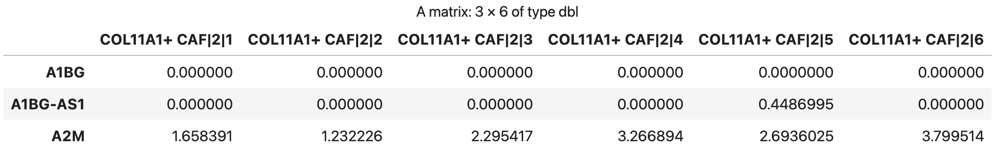
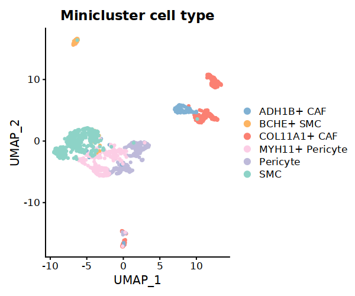
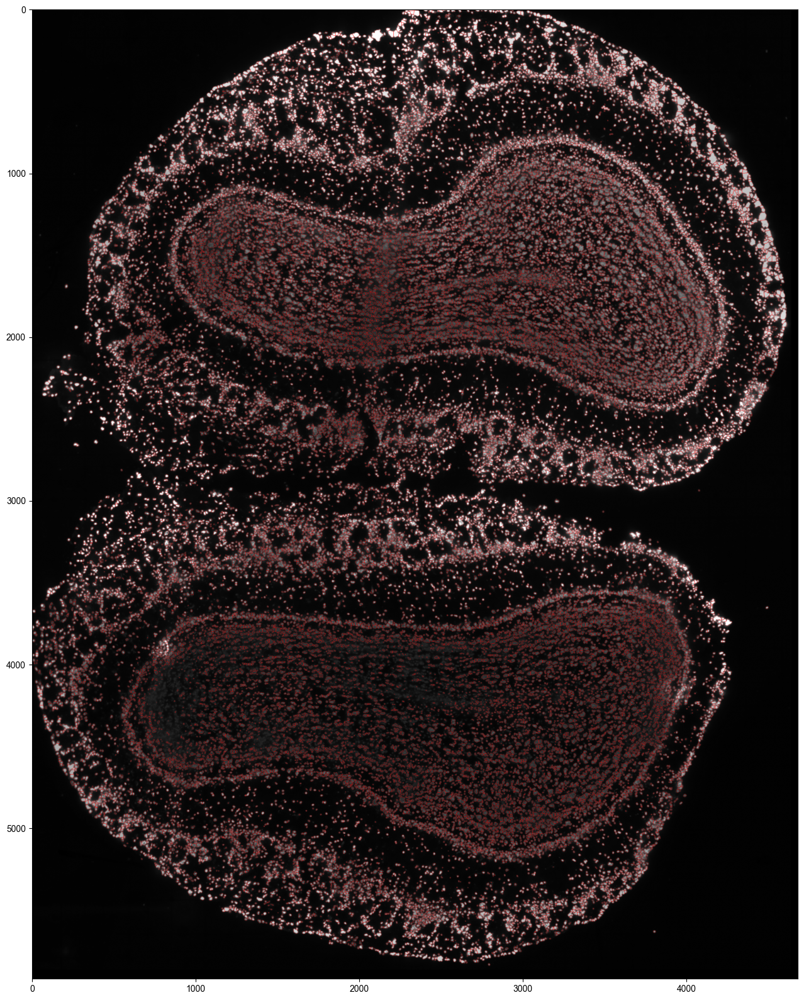

.. highlight:: shell

.. role:: bash(code)
   :language: bash

MetaModule(calculate the reaction which enriched in each metacell)
---------------------------------

Here we use a well annotated dataset to demonstrate the usage of the MetaModule function of MetroSCREEN. The original study provide the gene expression and cell annotation. Users can download the data and the information from `here <https://github.com/wanglabtongji/Cellist/tree/main/test/Stereoseq_Mouse_OB>`_.

Step 1 prepare the metacell
>>>>>>>>>>>>>>>>>>>>>>>>>>>>>>>>>>>>>>>>>>>>>>>>>>>>>>>>>>>>>>>>>>>

To mitigate the impact of technical noise and increase gene coverage, MetroSCREEN adopts a metacell strategy using :bash:`make_metacell` function. Detailed information about metacells can be found `here`. The number of cells in a metacell depends on the total number of cells. If the total exceeds 3000, the recommended number of cells per metacell is 30. For smaller cell populations, users can set a lower number of cells per metacell, but it should not be less than 10.
::
   
   Fibro.seurat <- readRDS('/fs/home/tangke/metabolism/tool/data/fibro_new.rds')
   options(repr.plot.width = 7, repr.plot.height = 5,repr.plot.res = 100)
   DimPlot(Fibro.seurat, reduction = "umap",group.by='F_cluster_annotation',cols=c('SMC'='#8DD3C7','MYH11+ Pericyte'='#FCCDE5','Pericyte'='#BEBADA','COL11A1+ CAF'='#FB8072','ADH1B+ CAF'='#80B1D3','BCHE+ SMC'='#FDB462'))

.. image:: ../_static/img/MetroSCREEN_cell_annotation.png
   :width: 50%
   :align: center

::

   ## set the split with the cell type information
   Fibro.seurat$split=paste0(Fibro.seurat$F_cluster_annotation) 
   ## construct the metacell
   make_metacell(Fibro.seurat,'split',10,'/fs/home/tangke/metabolism/tool/data/','fibro_new_metacell') 
   ## metacell object can be read
   metacell<-readRDS('/fs/home/tangke/metabolism/tool/data/fibro_new_metacell.rds')
   head(metacell)

After obtaining the metacell object, users can analyze the metacells in a similar way as with single-cell expression data. If there is batch effect in the data, it is recommended to construct the metacells separately for each dataset, then combine the metacells. After that, remove the batch effect and proceed with downstream analysis. The recommended workflow for batch effect removal is available here.
::

   ## create Seurat object for metacell matrix
   metacell.seurat <- CreateSeuratObject(counts = metacell, project = "metacell", min.cells = 0, min.features = 0)
   ## Normalize data
   metacell.seurat <- NormalizeData(metacell.seurat)
   ## Find variable features
   metacell.seurat <- FindVariableFeatures(metacell.seurat, selection.method = "vst", nfeatures = 2000)
   metacell.seurat <- ScaleData(metacell.seurat)
   ## Set the cell type information for Seurat object
   metacell.seurat@meta.data$cell_type=sapply(strsplit(rownames(metacell.seurat@meta.data),"[|]"), 
                                function(x) x[1])
   metacell.seurat <- RunPCA(metacell.seurat)        
   metacell.seurat <- RunUMAP(metacell.seurat, dims = 1:10)
   metacell.seurat <- FindNeighbors(metacell.seurat, dims = 1:10)
   metacell.seurat <- FindClusters(metacell.seurat, resolution = 0.6)
   options(repr.plot.width = 6, repr.plot.height = 5,repr.plot.res = 100)
   DimPlot(metacell.seurat, reduction = "umap",group.by='cell_type',cols=c('SMC'='#8DD3C7','MYH11+ Pericyte'='#FCCDE5','Pericyte'='#BEBADA','COL11A1+ CAF'='#FB8072','ADH1B+ CAF'='#80B1D3','BCHE+ SMC'='#FDB462'))+ggtitle("Minicluster cell type")

Step 2 Watershed segmentation of nucleus
>>>>>>>>>>>>>>>>>>>>>>>>>>>>>>>>>>>>>>>>

The initial nucleus segmentation is required for refined cell segmentation by Cellist. In Cellist, we utilize the watershed algorithm to segment nuclei in the ssDNA image, which is implemented by the function of :bash:`watershed`. 

::

   cellist watershed --gem Data/DP8400013846TR_F5.bin1.olfactorybulb_cropped.gem \
   --tif Result/Alignment/DP8400013846TR_F5_regist_transposed_aligned_by_Spateo.tiff \
   --min-distance 6 \
   --outdir Result/Watershed \
   --outprefix DP8400013846TR_F5

Step 3 Cell segmentation by Cellist
>>>>>>>>>>>>>>>>>>>>>>>>>>>>>>>>>>>

With nucleus segmentation completed, the next step is to expand the nucleus labels to include the cytoplasm, namely, cell segmentation. In cellist, we take both expression similarity and spatial proximity into consideration when assigning non-nucleus spots to labelled nuclei. 

::

   cellist seg --platform barcoding \
   --resolution 0.5 \
   --gem Data/DP8400013846TR_F5.bin1.olfactorybulb_cropped.gem \
   --spot-count-h5 Result/Watershed/DP8400013846TR_F5_bin1.h5 \
   --nuclei-prop Result/Watershed/DP8400013846TR_F5_watershed_nucleus_property.txt \
   --nuclei-count-h5 Result/Watershed/DP8400013846TR_F5_waterhsed_segmentation_cell_count.h5 \
   --watershed-seg Result/Watershed/DP8400013846TR_F5_watershed_nucleus_coord.txt \
   --nworkers 16 \
   --cell-radius 15 \
   --spot-imputation-distance 2.5 \
   --prob-cutoff 0.6 \
   --outdir Result/Cellist \
   --outprefix DP8400013846TR_F5

The results of :bash:`seg` will be stored in the :bash:`Result/Cellist` floder, and the detailed descritions are shown as below.

+-----------------------------------------------+-------------------------------------------------------------------------------+
| File                                          | Description                                                                   |
+===============================================+===============================================================================+
| Data_HVG/                                     | The directory stores small patches cropped from the slide.                    |
+-----------------------------------------------+-------------------------------------------------------------------------------+
| {outprefix}_segmentation.txt                  | The spot-level cell segmentation result where each row represents a spot.     |
+-----------------------------------------------+-------------------------------------------------------------------------------+
| {outprefix}_segmentation_cell_count.h5        | The aggrefated cell-level expression matrix, stored in the format of h5,      |
|                                               | where each row represents a gene and each column represents a cell.           |
+-----------------------------------------------+-------------------------------------------------------------------------------+
| {outprefix}_segmentation_cell_coord.txt       | The spatial coordinates of the segmented cells, which correspond to the cells |
|                                               | in the above expression file.                                                 |
+-----------------------------------------------+-------------------------------------------------------------------------------+
| {outprefix}_segmentation_plot.pdf             | Visualization of the cell segmentation results.                               |
+-----------------------------------------------+-------------------------------------------------------------------------------+
| {outprefix}_cellist_corr_nucl_cyto_df.txt     | The correlation of expression between nucleus and cytoplasm within each cell. |
+-----------------------------------------------+-------------------------------------------------------------------------------+
| parameters.json                               | Parameters to run :bash:`cellist` and statistics of the segmentation results. |
+-----------------------------------------------+-------------------------------------------------------------------------------+

Step 4 Spatially-aware expression imputation at the cell level (Optional)
>>>>>>>>>>>>>>>>>>>>>>>>>>>>>>>>>>>>>>>>>>>>>>>>>>>>>>>>>>>>>>>>>>>>>>>>>

In certain cases, the gene coverage within each cell may still be insufficient for in-depth single-cell analyses. To mitigate this issue, Cellist offers an optional imputation function that recovers missing gene expression at the cell level, leveraging information from neighboring cells close in both physical space and low dimensional embedding learned from expression data.

::

   cellist impute --expr Result/Cellist/alpha_0.8_sigma_1.0_beta_10_gene_HVG_dist_15_iter_False_prob_0.6_neigh_2.5/DP8400013846TR_F5_segmentation_cell_count.h5 \
   --spatial Result/Cellist/alpha_0.8_sigma_1.0_beta_10_gene_HVG_dist_15_iter_False_prob_0.6_neigh_2.5/DP8400013846TR_F5_segmentation_cell_coord.txt \
   --nworkers 8 \
   --outdir Result/Imputation_louvain \
   --outprefix DP8400013846TR_F5

