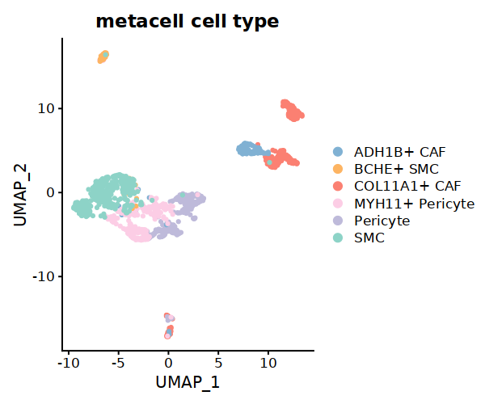

.. highlight:: shell

.. role:: bash(code)
   :language: bash

MetaModule(calculate the reaction which enriched in each metacell)
---------------------------------

Here we use a well annotated dataset to demonstrate the usage of the MetaModule function of MetroSCREEN. The original study provide the gene expression and cell annotation. Users can download the data and the information from `here <https://github.com/wanglabtongji/Cellist/tree/main/test/Stereoseq_Mouse_OB>`_.

Step 1 Prepare the metacell
>>>>>>>>>>>>>>>>>>>>>>>>>>>>>>>>>>>>>>>>>>>>>>>>>>>>>>>>>>>>>>>>>>>

To mitigate the impact of technical noise and increase gene coverage, MetroSCREEN adopts a metacell strategy using :bash:`make_metacell` function. Detailed information about metacells can be found `here`. The number of cells in a metacell depends on the total number of cells. If the total exceeds 3000, the recommended number of cells per metacell is 30. For smaller cell populations, users can set a lower number of cells per metacell, but it should not be less than 10.
::
   
   Fibro.seurat <- readRDS('/fs/home/tangke/metabolism/tool/data/fibro_new.rds')
   options(repr.plot.width = 7, repr.plot.height = 5,repr.plot.res = 100)
   DimPlot(Fibro.seurat, reduction = "umap",group.by='F_cluster_annotation',cols=c('SMC'='#8DD3C7','MYH11+ Pericyte'='#FCCDE5','Pericyte'='#BEBADA','COL11A1+ CAF'='#FB8072','ADH1B+ CAF'='#80B1D3','BCHE+ SMC'='#FDB462'))

.. image:: ../_static/img/MetroSCREEN_cell_annotation.png
   :width: 50%
   :align: center

::

   ## Set the split with the cell type information
   Fibro.seurat$split=paste0(Fibro.seurat$F_cluster_annotation) 

   ## Construct the metacell
   make_metacell(Fibro.seurat,'split',10,'/fs/home/tangke/metabolism/tool/data/','fibro_new_metacell') 

   ## metacell object can be read
   metacell<-readRDS('/fs/home/tangke/metabolism/tool/data/fibro_new_metacell.rds')

   ## The rows of the metacell are the genes, while the columns of the metacell are the cell type information. 
   ## The detailed cell information in a metacell was saved in fibro_new_metacell_info.rds
   metacell[1:3,1:6]

   # COL11A1+ CAF|2|1	COL11A1+ CAF|2|2	COL11A1+ CAF|2|3	COL11A1+ CAF|2|4	COL11A1+ CAF|2|5	COL11A1+ CAF|2|6
   # A1BG	0.000000	0.000000	0.000000	0.000000	0.0000000	0.000000
   # A1BG-AS1	0.000000	0.000000	0.000000	0.000000	0.4486995	0.000000
   # A2M	1.658391	1.232226	2.295417	3.266894	2.6936025	3.799514

The results of :bash:`seg` will be stored in the :bash:`Result/Cellist` floder, and the detailed descritions are shown as below.

+-----------------------------------------------+-------------------------------------------------------------------------------+
| File                                          | Description                                                                   |
+===============================================+===============================================================================+
| Data_HVG/                                     | The directory stores small patches cropped from the slide.                    |
+-----------------------------------------------+-------------------------------------------------------------------------------+
| {outprefix}_segmentation.txt                  | The spot-level cell segmentation result where each row represents a spot.     |
+-----------------------------------------------+-------------------------------------------------------------------------------+
| {outprefix}_segmentation_cell_count.h5        | The aggrefated cell-level expression matrix, stored in the format of h5,      |
|                                               | where each row represents a gene and each column represents a cell.           |
+-----------------------------------------------+-------------------------------------------------------------------------------+
| {outprefix}_segmentation_cell_coord.txt       | The spatial coordinates of the segmented cells, which correspond to the cells |
|                                               | in the above expression file.                                                 |
+-----------------------------------------------+-------------------------------------------------------------------------------+
| {outprefix}_segmentation_plot.pdf             | Visualization of the cell segmentation results.                               |
+-----------------------------------------------+-------------------------------------------------------------------------------+
| {outprefix}_cellist_corr_nucl_cyto_df.txt     | The correlation of expression between nucleus and cytoplasm within each cell. |
+-----------------------------------------------+-------------------------------------------------------------------------------+
| parameters.json                               | Parameters to run :bash:`cellist` and statistics of the segmentation results. |
+-----------------------------------------------+-------------------------------------------------------------------------------+

After obtaining the metacell object, users can analyze the metacells in a similar way as with single-cell expression data. If there is batch effect in the data, it is recommended to construct the metacells separately for each dataset, then combine the metacells. After that, remove the batch effect and proceed with downstream analysis. The recommended workflow for batch effect removal is available here.
::

   ## create Seurat object for metacell matrix
   metacell.seurat <- CreateSeuratObject(counts = metacell, project = "metacell", min.cells = 0, min.features = 0)

   ## Normalize data
   metacell.seurat <- NormalizeData(metacell.seurat)

   ## Find variable features
   metacell.seurat <- FindVariableFeatures(metacell.seurat, selection.method = "vst", nfeatures = 2000)

   metacell.seurat <- ScaleData(metacell.seurat)
   ## Set the cell type information for Seurat object
   metacell.seurat@meta.data$cell_type=sapply(strsplit(rownames(metacell.seurat@meta.data),"[|]"), 
                                function(x) x[1])
   metacell.seurat <- RunPCA(metacell.seurat)        
   metacell.seurat <- RunUMAP(metacell.seurat, dims = 1:10)
   metacell.seurat <- FindNeighbors(metacell.seurat, dims = 1:10)
   metacell.seurat <- FindClusters(metacell.seurat, resolution = 0.6)
   options(repr.plot.width = 6, repr.plot.height = 5,repr.plot.res = 100)

   DimPlot(metacell.seurat, reduction = "umap",group.by='cell_type',cols=c('SMC'='#8DD3C7','MYH11+ Pericyte'='#FCCDE5','Pericyte'='#BEBADA','COL11A1+ CAF'='#FB8072','ADH1B+ CAF'='#80B1D3','BCHE+ SMC'='#FDB462'))+ggtitle("Minicluster cell type")

Step 2 Calculate the MetaModule score
>>>>>>>>>>>>>>>>>>>>>>>>>>>>>>>>>>>>>>>>

Calculate the MetaModule score using the :bash:`cal_MetaModule` function. Users can utilize the reactions and corresponding information provided by Recon3. Since some of this information is duplicated, users can use the simplified version provided by MetroSCREEN. Alternatively, users can manually create and use gene sets of interest.

::

   ## MM: contains reaction lists of the genes
   MM=readRDS("/fs/home/tangke/metabolism/tool/data/MM.nodup.rds")

   ## MM.meta: metabolic information of these reacrions
   MM.meta=readRDS("/fs/home/tangke/metabolism/tool/data/MM.meta.rds") %>%
         as.data.frame()
   rownames(MM.meta)=MM.meta$ID

   MM[[1]]
   ## $`HMR-0154` =
   ## 'ACOT7''ACOT2''ACOT9''BAAT''ACOT4''ACOT1''ACOT6'

   MM.meta[1:3,]
   #	ID	NAME	EQUATION	EC-NUMBER	GENE ASSOCIATION	LOWER BOUND	UPPER BOUND	OBJECTIVE	COMPARTMENT	MIRIAM	SUBSYSTEM	REPLACEMENT ID	NOTE	REFERENCE	CONFIDENCE SCORE
   # <lgl>	<chr>	<chr>	<chr>	<chr>	<chr>	<lgl>	<lgl>	<lgl>	<lgl>	<chr>	<chr>	<lgl>	<lgl>	<chr>	<dbl>
   # HMR-0154	NA	HMR-0154	NA	H2O[c] + propanoyl-CoA[c] => CoA[c] + H+[c] + propanoate[c]       	3.1.2.2	ENSG00000097021 or ENSG00000119673 or ENSG00000123130 or ENSG00000136881 or ENSG00000177465 or ENSG00000184227 or ENSG00000205669	NA	NA	NA	NA	sbo/SBO:0000176	Acyl-CoA hydrolysis	NA	NA	PMID:11013297;PMID:11013297	0
   # HMR-0189	NA	HMR-0189	NA	H2O[c] + lauroyl-CoA[c] => CoA[c] + H+[c] + lauric acid[c]        	3.1.2.2	ENSG00000097021 or ENSG00000119673 or ENSG00000136881 or ENSG00000177465 or ENSG00000184227 or ENSG00000205669                   	NA	NA	NA	NA	sbo/SBO:0000176	Acyl-CoA hydrolysis	NA	NA	NA                         	0
   # HMR-0193	NA	HMR-0193	NA	H2O[c] + tridecanoyl-CoA[c] => CoA[c] + H+[c] + tridecylic acid[c]	3.1.2.2	ENSG00000097021 or ENSG00000119673 or ENSG00000136881 or ENSG00000177465 or ENSG00000184227 or ENSG00000205669                   	NA	NA	NA	NA	sbo/SBO:0000176	Acyl-CoA hydrolysis	NA	NA	NA                         	0

In this section, MetroSCREEN calculates the MetaModule score for each metacell. To identify differentially enriched MetaModules for each identity class in a dataset, the :bash`FindAllMarkers` function from Seurat will be used.

::

   ## Calculate the MetaModule score
   cal_MetaModule(metacell,MM,'/fs/home/tangke/metabolism/tool/data/','fibro_new_metacell_gsva')

   ## Construct the MetaModule score Seurat object, the row is the Metamodule, the column is the metacell
   metacell.gsva=readRDS("/fs/home/tangke/metabolism/tool/data/fibro_new_metacell_gsva.rds")
   metacell.gsva.seurat <- CreateSeuratObject(counts = metacell.gsva, project = "metacell", min.cells = 0, min.features = 0)

   ## Add the cell type information to the metacell
   metacell.gsva.seurat@meta.data$cell_type=sapply(strsplit(rownames(metacell.gsva.seurat@meta.data),"[|]"),function(x) x[1])
   metacell.gsva.seurat@active.ident=as.factor(metacell.gsva.seurat$cell_type)

   ## Find the differentially enriched MetaModule for each of the identity classes in a dataset
   markers <- FindAllMarkers(metacell.gsva.seurat, only.pos = TRUE)  
   ## Add metabolic information for the differentially wnriched MetaModule
   markers$metabolic_type=MM.meta[markers$gene,'SUBSYSTEM']
   markers$reaction=MM.meta[markers$gene,'EQUATION']
   head(markers)

   # p_val	avg_log2FC	pct.1	pct.2	p_val_adj	cluster	gene	metabolic_type	reaction
   # <dbl>	<dbl>	<dbl>	<dbl>	<dbl>	<fct>	<chr>	<chr>	<chr>
   # ESTRAABCtc	1.427178e-49	1.5298256	0.927	0.159	2.239243e-46	ADH1B+ CAF	ESTRAABCtc	Transport reactions  	ATP[c] + estradiol-17beta 3-glucuronide[s] + H2O[c] => ADP[c] + estradiol-17beta 3-glucuronide[c] + H+[c] + Pi[c]
   # HMR-8559	2.857953e-41	1.2123590	0.917	0.224	4.484128e-38	ADH1B+ CAF	HMR-8559  	Eicosanoid metabolism	prostaglandin D2[r] <=> prostaglandin H2[r]                                                                      
   # HMR-9514	3.597369e-36	0.7508997	0.906	0.338	5.644273e-33	ADH1B+ CAF	HMR-9514  	Isolated             	NADPH[c] + O2[c] + trimethylamine[c] => H2O[c] + NADP+[c] + trimethylamine-N-oxide[c]                    

The results of :bash:`seg` will be stored in the :bash:`Result/Cellist` floder, and the detailed descritions are shown as below.

+-----------------------------------------------+-------------------------------------------------------------------------------+
| File                                          | Description                                                                   |
+===============================================+===============================================================================+
| Data_HVG/                                     | The directory stores small patches cropped from the slide.                    |
+-----------------------------------------------+-------------------------------------------------------------------------------+
| {outprefix}_segmentation.txt                  | The spot-level cell segmentation result where each row represents a spot.     |
+-----------------------------------------------+-------------------------------------------------------------------------------+
| {outprefix}_segmentation_cell_count.h5        | The aggrefated cell-level expression matrix, stored in the format of h5,      |
|                                               | where each row represents a gene and each column represents a cell.           |
+-----------------------------------------------+-------------------------------------------------------------------------------+
| {outprefix}_segmentation_cell_coord.txt       | The spatial coordinates of the segmented cells, which correspond to the cells |
|                                               | in the above expression file.                                                 |
+-----------------------------------------------+-------------------------------------------------------------------------------+
| {outprefix}_segmentation_plot.pdf             | Visualization of the cell segmentation results.                               |
+-----------------------------------------------+-------------------------------------------------------------------------------+
| {outprefix}_cellist_corr_nucl_cyto_df.txt     | The correlation of expression between nucleus and cytoplasm within each cell. |
+-----------------------------------------------+-------------------------------------------------------------------------------+
| parameters.json                               | Parameters to run :bash:`cellist` and statistics of the segmentation results. |
+-----------------------------------------------+-------------------------------------------------------------------------------+

Step 3 MetaModule analysis
>>>>>>>>>>>>>>>>>>>>>>>>>>>>>>>>>>>

With nucleus segmentation completed, the next step is to expand the nucleus labels to include the cytoplasm, namely, cell segmentation. In cellist, we take both expression similarity and spatial proximity into consideration when assigning non-nucleus spots to labelled nuclei. 

::

   metacell.gsva.seurat@assays$RNA@scale.data=as.matrix(metacell.gsva.seurat@assays$RNA@counts)
   ## show the top 10 most enriched MetaModule for each cell type
   markers %>%
   group_by(cluster) %>%
   arrange(desc(avg_log2FC), .by_group = TRUE) %>%
   slice_head(n = 10) %>%
   ungroup() -> top10

.. image:: ../_static/img/MetroSCREEN_top10_marker.png
   :width: 50%
   :align: center

The results of :bash:`seg` will be stored in the :bash:`Result/Cellist` floder, and the detailed descritions are shown as below.

Step 4 Spatially-aware expression imputation at the cell level (Optional)
>>>>>>>>>>>>>>>>>>>>>>>>>>>>>>>>>>>>>>>>>>>>>>>>>>>>>>>>>>>>>>>>>>>>>>>>>

In certain cases, the gene coverage within each cell may still be insufficient for in-depth single-cell analyses. To mitigate this issue, Cellist offers an optional imputation function that recovers missing gene expression at the cell level, leveraging information from neighboring cells close in both physical space and low dimensional embedding learned from expression data.

::

   cellist impute --expr Result/Cellist/alpha_0.8_sigma_1.0_beta_10_gene_HVG_dist_15_iter_False_prob_0.6_neigh_2.5/DP8400013846TR_F5_segmentation_cell_count.h5 \
   --spatial Result/Cellist/alpha_0.8_sigma_1.0_beta_10_gene_HVG_dist_15_iter_False_prob_0.6_neigh_2.5/DP8400013846TR_F5_segmentation_cell_coord.txt \
   --nworkers 8 \
   --outdir Result/Imputation_louvain \
   --outprefix DP8400013846TR_F5

