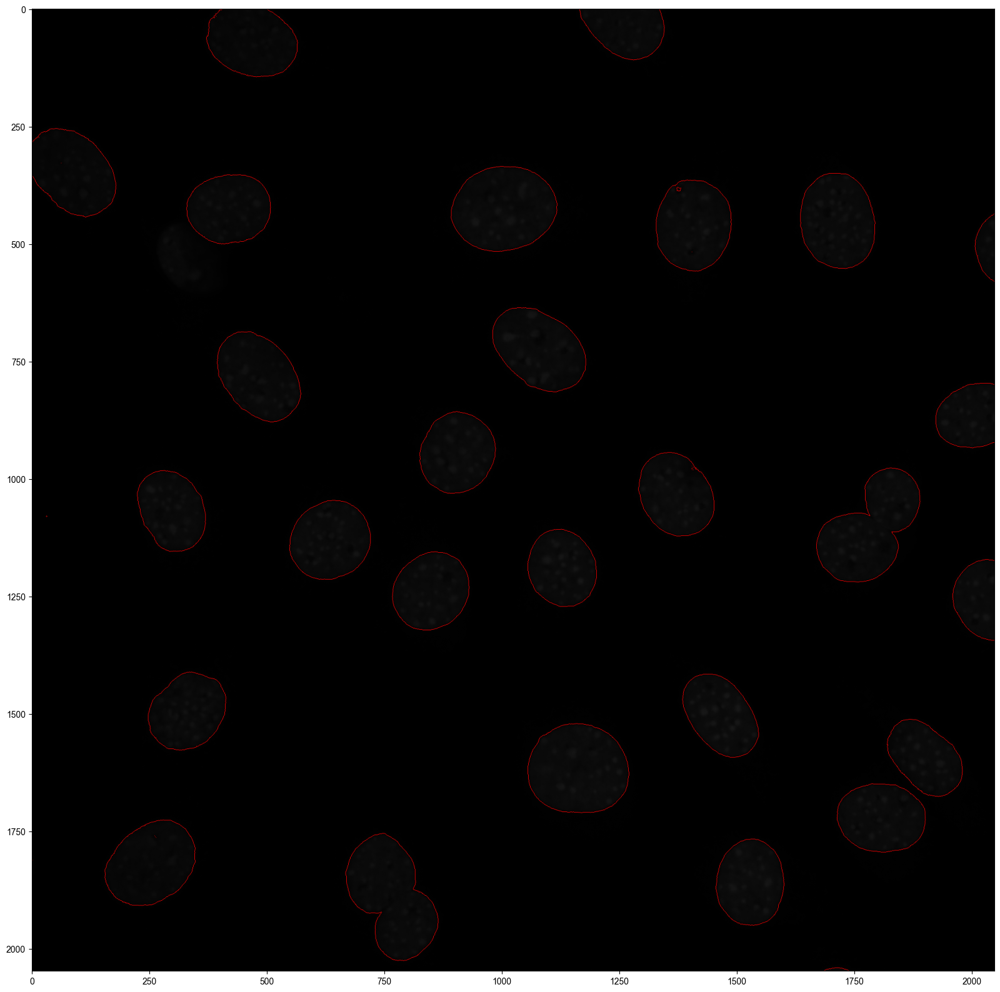

.. highlight:: shell

.. role:: bash(code)
   :language: bash

NIH/3T3 (seqFISH+)
------------------

Here we demonstrate the application of Cellist on the imaging-based high-resolution platform. The NIH/3T3 seqFISH+ data was derived from the study of `Eng et al., Nature, 2019 <https://www.nature.com/articles/s41586-019-1049-y>`_, which profiles 10,000 genes in 7 field of views (FOVs) with auxiliary DAPI staining. Users can download the demo data from `here <https://github.com/wanglabtongji/Cellist/tree/main/test/seqFISH_NIH3T3>`_.

Step 1 Pre-process
>>>>>>>>>>>>>>>>>>

Cellist is initially designed for the barcoding-based high-resolution spatial transcriptomics where each spot captures multiple transcripts. But in the seqFISH+ data of single-molecule resolution, each pixel is around 103 nm. To make the seqFISH+ data suitable for Cellist, transcripts are aggregated within each bin (5 pixels × 5 pixels), treating each bin as a spot akin to Stereo-seq. This process results in binned data with a comparable resolution (~0.5 μm) to Stereo-seq, suitable for Cellist. 

^^^^^^^^^^^^^^^^^^^^^^^^^^^^^^^^^^^^^^^^^^^^^
1. Convert array-like data to long data frame
^^^^^^^^^^^^^^^^^^^^^^^^^^^^^^^^^^^^^^^^^^^^^

.. code:: python

   import os
   import sys
   import scipy.io as sio
   import pandas as pd
   from Cellist.Utility import *
   from Cellist.Plot import *
   from Cellist.IO import *

   data_dir = 'Data'
   res_dir = 'Result/Preprocess'
   if not os.path.exists(res_dir):
      os.makedirs(res_dir)

   run_mat_file = os.path.join(data_dir, 'RNA_locations_run_1.mat')
   gene_mat_file = os.path.join(data_dir, 'all_gene_Names.mat')

   mat_contents = sio.loadmat(run_mat_file)
   tot = mat_contents['tot']

   gene_mat = sio.loadmat(gene_mat_file)
   gene_list_all = gene_mat['allNames'].flatten()
   gene_list_all = [i[0] for i in gene_list_all]

   x_list = []
   y_list = []
   cell_list = []
   gene_list = []
   fov_list = []
   for i in range(tot.shape[0]):
       print(i)
       for j in range(tot.shape[1]):
           for m in range(tot.shape[2]):
               if tot[i,j,m].shape[1] == 3:
                   x_list = x_list + tot[i,j,m][:,1].tolist()
                   y_list = y_list + tot[i,j,m][:,0].tolist()
                   cell_list = cell_list + ['Cell_%s' %j]*len(tot[i,j,m][:,0].tolist())
                   gene_list = gene_list + [gene_list_all[m]]*len(tot[i,j,m][:,0].tolist())
                   fov_list = fov_list + ['FOV_%s' %i]*len(tot[i,j,m][:,0].tolist())

   coord_count_df = pd.DataFrame({'x':x_list, 'y':y_list, 'Manual_cell': cell_list, 'geneID': coord_count_df['geneID'], 'FOV': fov_list, 'MIDCounts': 1})
   coord_count_df.to_csv(os.path.join(res_dir, 'seqFISH+_NIH3T3_points_RNA_rep1.txt'), sep = '\t', index = False)

^^^^^^^^^^^^^^^^^^^^^^^^^^^^^^^^^^^^^^^^^^^^^^^^^^^^^^^^
2. Generate pixel-level and bin-level data (5-pixel bin)
^^^^^^^^^^^^^^^^^^^^^^^^^^^^^^^^^^^^^^^^^^^^^^^^^^^^^^^^

.. code:: python

   coord_count_df = pd.read_csv(os.path.join(res_dir, 'seqFISH+_NIH3T3_points_RNA_rep1.txt'), sep = '\t', header = 0)
   for fov in coord_count_df['FOV'].unique():
      print(fov)
      out_dir = os.path.join(res_dir, fov)
      if not os.path.exists(out_dir):
         os.mkdir(out_dir)
      fov_count_df = coord_count_df.copy()
      fov_count_df = fov_count_df.loc[fov_count_df['FOV'] == fov,:]
      fov_count_df['x'] = fov_count_df['x'].astype(int)
      fov_count_df['y'] = fov_count_df['y'].astype(int)
      fov_coord_df = fov_count_df.drop_duplicates(["x", "y"])
      fov_coord_df['Manual_cell_ID'] = fov_coord_df['Manual_cell'].astype('category')
      fov_coord_df['Manual_cell_ID'] = fov_coord_df['Manual_cell_ID'].cat.codes + 1
      # draw the manual segmentation result
      draw_segmentation(fov_coord_df, "Manual_cell_ID", "%s_Manual" %fov, out_dir, x = "x", y = "y", figsize = (20,20))
      # write bin1 
      bin1_count_df = coord_count_df.copy()
      bin1_count_df = bin1_count_df.loc[bin1_count_df['FOV'] == fov,:]
      bin1_count_df['x'] = bin1_count_df['x'].astype(int)
      bin1_count_df['y'] = bin1_count_df['y'].astype(int)
      bin1_count_df = bin1_count_df[["geneID", "x", "y", "MIDCounts"]]
      bin1_count_df = bin1_count_df.sort_values(by = ["x", "y"])
      bin1_count_df.to_csv(os.path.join(out_dir, 'seqFISH+_NIH3T3_points_RNA_rep1_%s_bin1.txt' %fov), sep = '\t', index = False)
      bin1_count_df['x_y'] = bin1_count_df['x'].astype(str) + '_' + bin1_count_df['y'].astype(str)
      gene_spot = bin1_count_df['MIDCounts'].groupby([bin1_count_df['x_y'], bin1_count_df['geneID']]).sum()
      spot_expr_mat, gene_list, spot_list = longdf_to_mat(gene_spot)
      count_h5_file = os.path.join(out_dir, "seqFISH+_NIH3T3_points_RNA_rep1_%s_bin1.h5" %fov)
      write_10X_h5(filename = count_h5_file, matrix = spot_expr_mat, features = gene_list, barcodes = spot_list, datatype = 'Gene')
      # write bin5
      countname = 'MIDCounts'
      bin_size = 5
      bin1_count_df['x_bin'] = (bin1_count_df['x']/bin_size).astype(np.uint32)*bin_size
      bin1_count_df['y_bin'] = (bin1_count_df['y']/bin_size).astype(np.uint32)*bin_size
      bin1_count_df['binID'] = bin1_count_df['x_bin'].astype(str) + "_" + bin1_count_df['y_bin'].astype(str)
      bin5_count_df = bin1_count_df[countname].groupby([bin1_count_df['x_bin'], bin1_count_df['y_bin'], bin1_count_df['geneID']]).sum()
      bin5_count_df = pd.DataFrame(bin5_count_df)
      bin5_count_df.index.names=['x', 'y', 'geneID']
      bin5_count_df = pd.concat([bin5_count_df.index.to_frame(), bin5_count_df],axis=1)
      bin5_count_df = bin5_count_df[['geneID', 'x', 'y', 'MIDCounts']]
      bin5_count_df.to_csv(os.path.join(out_dir, 'seqFISH+_NIH3T3_points_RNA_rep1_%s_bin5.txt' %fov), sep = '\t', index = False)
      bin5_count_df['x_y'] = bin5_count_df['x'].astype(str) + '_' + bin5_count_df['y'].astype(str)
      gene_spot = bin5_count_df['MIDCounts'].groupby([bin5_count_df['x_y'], bin5_count_df['geneID']]).sum()
      spot_expr_mat, gene_list, spot_list = longdf_to_mat(gene_spot)
      count_h5_file = os.path.join(out_dir,  "seqFISH+_NIH3T3_points_RNA_rep1_%s_bin5.h5" %fov)
      write_10X_h5(filename = count_h5_file, matrix = spot_expr_mat, features = gene_list, barcodes = spot_list, datatype = 'Gene')

^^^^^^^^^^^^^^^^^^^^^^^^^^^^^^^^^^^^^^^^^
3. Convert OME-TIFF file to 2D TIFF image
^^^^^^^^^^^^^^^^^^^^^^^^^^^^^^^^^^^^^^^^^

.. code:: python

   from pyometiff import OMETIFFReader
   from skimage.io import imread, imsave

   data_dir = 'Data'
   res_dir = 'Result/Preprocess'

   for fov in range(7):
      out_dir = os.path.join(res_dir, 'FOV_%s' %fov)
      print(out_dir)
      if not os.path.exists(out_dir):
        os.mkdir(out_dir)
      img_path = os.path.join(data_dir, 'DAPI_experiment1/final_background_experiment1/MMStack_Pos%s.ome.tif' %fov)
      reader = OMETIFFReader(fpath = img_path)
      img_array, xml_metadata = reader.read()
      img = img_array[3,1,:,:]
      imsave(os.path.join(out_dir, 'MMStack_Pos%s_2D.tif' %fov), img)

Step 2 Watershed segmentation of nucleus
>>>>>>>>>>>>>>>>>>>>>>>>>>>>>>>>>>>>>>>>

The initial nucleus segmentation is required for refined cell segmentation by Cellist. In Cellist, we utilize the watershed algorithm to segment nuclei in the DAPI staining image, which is implemented by the function of :bash:`watershed`. Here we take `FOV_0` as an example.

::

   cellist watershed --platform imaging \
   --gem Result/Preprocess/FOV_0/seqFISH+_NIH3T3_points_RNA_rep1_FOV_0_bin5.txt \
   --tif Result/Preprocess/FOV_0/MMStack_Pos0_2D.tif \
   --min-distance 100 \
   --outdir Result/Watershed/FOV_0 \
   --outprefix FOV_0

Step 3 Cell segmentation by Cellist
>>>>>>>>>>>>>>>>>>>>>>>>>>>>>>>>>>>

With nucleus segmentation completed, the next step is to expand the nucleus labels to include the cytoplasm, namely, cell segmentation. In cellist, we take both expression similarity and spatial proximity into consideration when assigning non-nucleus spots to labelled nuclei. 

::

   cellist seg --platform imaging \
   --resolution 0.1 \
   --gem Result/Preprocess/FOV_0/seqFISH+_NIH3T3_points_RNA_rep1_FOV_0_bin5.txt \
   --spot-count-h5 Result/Preprocess/FOV_0/seqFISH+_NIH3T3_points_RNA_rep1_FOV_0_bin5.h5 \
   --nuclei-prop Result/Watershed/FOV_0/FOV_0_watershed_nucleus_property.txt \
   --nuclei-count-h5 Result/Watershed/FOV_0/FOV_0_waterhsed_segmentation_cell_count.h5 \
   --watershed-seg Result/Watershed/FOV_0/FOV_0_watershed_nucleus_coord.txt \
   --nworkers 16 \
   --cell-radius 18 \
   --spot-imputation-distance 2.5 \
   --prob-cutoff 0.1 \
   --outdir Result/Cellist/FOV_0 \
   --outprefix FOV_0

.. image:: ../_static/img/FOV_0_Cellist_segmentation_plot.png
   :width: 100%
   :align: center
