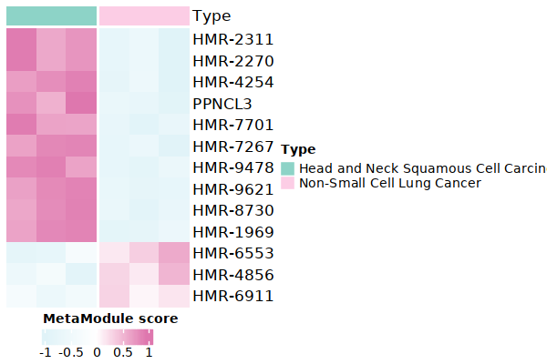
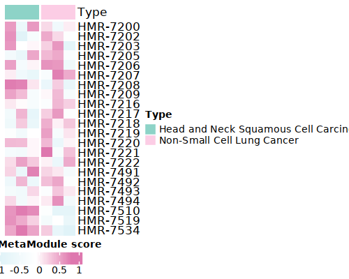
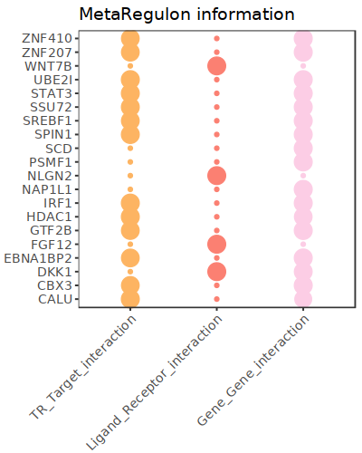
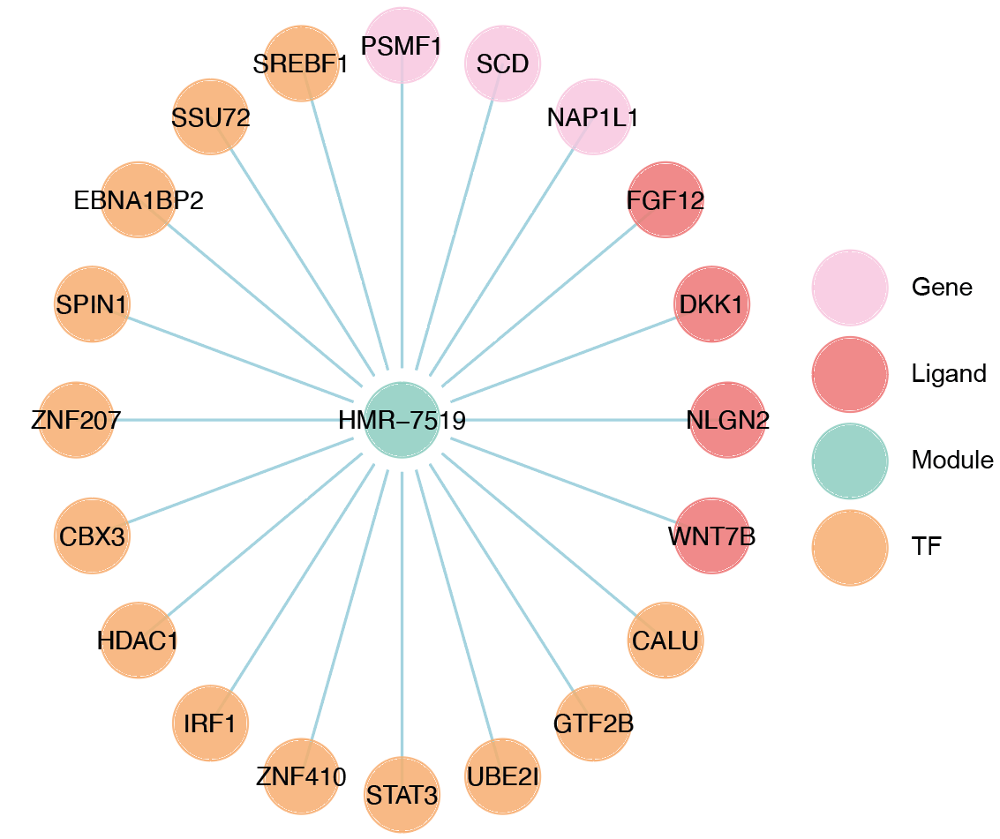

.. highlight:: shell

.. role:: bash(code)
   :language: bash

MetroSCREEN(RNA-seq)
---------------------------------

For bulk RNA-seq data, MetroSCREEN calculates the MetaModule score for each sample and then builds a MetaRegulon for each dysregulated MetaModule, which provides insights into the mechanisms of metabolic regulation. Besides, MetroSCREEN delineates the source of the MetaRegulon. Considering that several samples are not suitable to infer the causation between MetaModule and MetaRegulon, the direction for bulk RNA-seq data is not provided. 

To demonstrate the usage of the MetaModule and MetaRegulon function of MetroSCREEN in bulk RNA-seq data, we downloaded the dataset from `here <https://zenodo.org/uploads/14160398>`_.

Step 1 MetaModule analysis
>>>>>>>>>>>>>>>>>>>>>>>>>>>>>>>>>>>>>>>>

^^^^^^^^^^^^^^^^^^^^^^^^^^^^^^^^^^^^^^^^^^^^^^^^^^^^^^^^
1. Prepare the metabolic information
^^^^^^^^^^^^^^^^^^^^^^^^^^^^^^^^^^^^^^^^^^^^^^^^^^^^^^^^

Here we utilized the metabolic reactions and corresponding information provided by `Recon3D <https://www.nature.com/articles/nbt.4072>`_. Since some of this information is duplicated, we provided a simplified version. Users can download it from `here <https://zenodo.org/uploads/14160223>`_. Alternatively, users can manually create and use gene sets of interest. We recommend that both the treatment and control groups contain at least three sets of data.

.. code-block:: r
   
   library(MetroSCREEN)

   ## Metabolic reactions and detaild description for them
   MM=readRDS("./ref/MM.nodup.rds")
   MM.meta=readRDS("./ref/MM.meta.rds") %>% as.data.frame()
   rownames(MM.meta)=MM.meta$ID

   MM[1:2]
   # $`HMR-0154`
   # 'ACOT7''ACOT2''ACOT9''BAAT''ACOT4''ACOT1''ACOT6'
   # $`HMR-0189`
   # 'ACOT7''ACOT2''BAAT''ACOT4''ACOT1''ACOT6'

   MM.meta[1:3,]
   #	ID	NAME	EQUATION	EC-NUMBER	GENE ASSOCIATION	LOWER BOUND	UPPER BOUND	OBJECTIVE	COMPARTMENT	MIRIAM	SUBSYSTEM	REPLACEMENT ID	NOTE	REFERENCE	CONFIDENCE SCORE
   # <lgl>	<chr>	<chr>	<chr>	<chr>	<chr>	<lgl>	<lgl>	<lgl>	<lgl>	<chr>	<chr>	<lgl>	<lgl>	<chr>	<dbl>
   # HMR-0154	NA	HMR-0154	NA	H2O[c] + propanoyl-CoA[c] => CoA[c] + H+[c] + propanoate[c]       	3.1.2.2	ENSG00000097021 or ENSG00000119673 or ENSG00000123130 or ENSG00000136881 or ENSG00000177465 or ENSG00000184227 or ENSG00000205669	NA	NA	NA	NA	sbo/SBO:0000176	Acyl-CoA hydrolysis	NA	NA	PMID:11013297;PMID:11013297	0
   # HMR-0189	NA	HMR-0189	NA	H2O[c] + lauroyl-CoA[c] => CoA[c] + H+[c] + lauric acid[c]        	3.1.2.2	ENSG00000097021 or ENSG00000119673 or ENSG00000136881 or ENSG00000177465 or ENSG00000184227 or ENSG00000205669                   	NA	NA	NA	NA	sbo/SBO:0000176	Acyl-CoA hydrolysis	NA	NA	NA                         	0
   # HMR-0193	NA	HMR-0193	NA	H2O[c] + tridecanoyl-CoA[c] => CoA[c] + H+[c] + tridecylic acid[c]	3.1.2.2	ENSG00000097021 or ENSG00000119673 or ENSG00000136881 or ENSG00000177465 or ENSG00000184227 or ENSG00000205669                   	NA	NA	NA	NA	sbo/SBO:0000176	Acyl-CoA hydrolysis	NA	NA	NA                         	0

^^^^^^^^^^^^^^^^^^^^^^^^^^^^^^^^^^^^^^^^^^^^^^^^^^^^^^^^
2. Calculate the MetaModule score
^^^^^^^^^^^^^^^^^^^^^^^^^^^^^^^^^^^^^^^^^^^^^^^^^^^^^^^^

In this section, MetroSCREEN calculates the MetaModule score for each sample by using :bash:`cal_MetaModule` function. To identify differentially enriched MetaModules for each group in the experimental design, the :bash:`FindAllMarkers_MetaModule` function from MetroSCREEN will be used. This function is similar to the  :bash:`FindAllMarkers` function in `Seurat <https://satijalab.org/seurat/>`_, allowing users to use similar parameters. The results of :bash:`cal_MetaModule` will be stored in the :bash:`./CCLE/` folder.

.. code-block:: r
   
   expression<-readRDS('./CCLE/ccle.rds')
   ## Calculate the MetaModule score
   cal_MetaModule(expression,MM,'./CCLE/','ccle_gsva')
   ccle.gsva=readRDS('./CCLE/ccle_gsva.rds')

^^^^^^^^^^^^^^^^^^^^^^^^^^^^^^^^^^^^^^^^^^^^^^^^^^^^^^^^
3.  MetaModule score exploration
^^^^^^^^^^^^^^^^^^^^^^^^^^^^^^^^^^^^^^^^^^^^^^^^^^^^^^^^

.. code-block:: r

   ## Read the sample information object for each sample
   sample_info<-readRDS('./CCLE/ccle_meta.rds')

   head(sample_info)

   # NCIH2106Non-Small Cell Lung CancerUPCISCC040Head and Neck Squamous Cell CarcinomaUPCISCC074Head and Neck Squamous Cell CarcinomaUPCISCC200Head and Neck Squamous Cell CarcinomaNCIH1155Non-Small Cell Lung CancerNCIH1385Non-Small Cell Lung Cancer
   # Levels:
   # 'Head and Neck Squamous Cell Carcinoma''Non-Small Cell Lung Cancer'

   ## Find the differentially enriched MetaModule for each group
   MetaModule.markers=FindAllMarkers_MetaModule(ccle.gsva,sample_info,'bulk')  
   MetaModule.markers$metabolic_type=MM.meta[MetaModule.markers$gene,'SUBSYSTEM']
   MetaModule.markers$reaction=MM.meta[MetaModule.markers$gene,'EQUATION']

   head(MetaModule.markers)

   # p_val	avg_log2FC	pct.1	pct.2	p_val_adj	cluster	gene	metabolic_type	reaction
   # <dbl>	<dbl>	<dbl>	<dbl>	<dbl>	<fct>	<chr>	<chr>	<chr>
   # HMR-4843	3.755633e-05	2.730885	1	0	0.06418377	Head and Neck Squamous Cell Carcinoma	HMR-4843	Transport reactions	GDP[c] + GTP[m] <=> GDP[m] + GTP[c]                                                      
   # HMR-1969	9.059557e-05	2.891705	1	0	0.15482783	Head and Neck Squamous Cell Carcinoma	HMR-1969	Androgen metabolism	dehydroepiandrosterone[c] + PAPS[c] => dehydroepiandrosterone sulfate[c] + H+[c] + PAP[c]
                  

   saveRDS(MetaModule.markers,'./CCLE/ccle_gsva_markers.rds')

^^^^^^^^^^^^^^^^^^^^^^^^^^^^^^^^^^^^^^^^^^^^^^^^^^^^^^^^
4. Visualization
^^^^^^^^^^^^^^^^^^^^^^^^^^^^^^^^^^^^^^^^^^^^^^^^^^^^^^^^

Here, we give two examples for the following analysis.

.. code-block:: r

   ## Show the top 10 most enriched MetaModule for each group
   top10<- MetaModule.markers %>%
      group_by(cluster) %>%
      arrange(desc(avg_log2FC), .by_group = TRUE) %>%
      slice_head(n = 10) %>%
      ungroup()

   doheatmap_feature(ccle.gsva,sample_info,top10$gene,6,4,cols=c('Head and Neck Squamous Cell Carcinoma'='#8DD3C7','Non-Small Cell Lung Cancer'='#FCCDE5'))

If users are interested in a specific pathway and want to identify the detailed reactions that differentiate various groups, they can exclusively set the pathways.

.. code-block:: r

   ## Here we give an example with Chondroitin / heparan sulfate biosynthesis pathway 
   doheatmap_feature(ccle.gsva,sample_info,MM.meta[MM.meta$SUBSYSTEM=='Chondroitin / heparan sulfate biosynthesis','ID'],5,4,
                 cols=c('Head and Neck Squamous Cell Carcinoma'='#8DD3C7','Non-Small Cell Lung Cancer'='#FCCDE5'))

Step 2 MetaRegulon analysis
>>>>>>>>>>>>>>>>>>>>>>>>>>>>>>>>>>>>>>>>

MetroSCREEN systematically considers the combined effects of intrinsic cellular drivers and extrinsic environmental factors of metabolic regulation.

^^^^^^^^^^^^^^^^^^^^^^^^^^^^^^^^^^^^^^^^^^^^^^^^^^^^^^^^
1. Prepare the essential files
^^^^^^^^^^^^^^^^^^^^^^^^^^^^^^^^^^^^^^^^^^^^^^^^^^^^^^^^

Find the marker genes for each group, this is the basis for MetaRegulon activity calculation.

.. code-block:: r

   ## Read sample expression and group information
   expression<-readRDS('./CCLE/ccle.rds')
   sample_info<-readRDS('./CCLE/ccle_meta.rds')

   ## Considering the TPM format for the expression data, the limma package was utilized. If the expression is raw count, please use the DESeq2 package
   group_list <- factor(c(rep("control",1), rep("treat",3),rep("control",2)))
   design <- model.matrix(~sample_info)
   colnames(design) <- levels(group_list)
   rownames(design) <- colnames(expression)

   fit <- lmFit(expression, design)
   fit <- eBayes(fit)
   DE_genes <- topTable(fit, coef = 2,p.value = 0.05, lfc = log2(1.5), number = Inf,sort.by="logFC")

   DE_genes$cluster=ifelse(DE_genes$logFC>0,'Head and Neck Squamous Cell Carcinoma','Non-Small Cell Lung Cancer')
   DE_genes$gene=rownames(DE_genes)
   DE_genes=DE_genes[order(abs(DE_genes$logFC),decreasing = TRUE),]
   saveRDS(DE_genes,'./CCLE/ccle_gene_markers.rds')

Prepare the Lisa results for each group. This is the basis for MetaRegulon TR activity calculation. Users can known more about Lisa `here <https://genomebiology.biomedcentral.com/articles/10.1186/s13059-020-1934-6>`_.

.. code-block:: r

   for (i in unique(DE_genes$cluster)){
      df=DE_genes[DE_genes$cluster==i,]
      if (nrow(df)>500){
         genes=df[,'gene'][1:500]
      } else{ß
         genes=df[,'gene']
      }
      
      write.table(genes,paste0('./CCLE/lisa/',i,':marker.txt'),
               sep='\t',
               quote=F,
            row.names=FALSE,
            col.names=FALSE)
   }

::
   
   ## Run this under Lisa's guidance
   lisa multi hg38 ./CCLE/lisa/*.txt -b 501 -o ./CCLE/lisa/

^^^^^^^^^^^^^^^^^^^^^^^^^^^^^^^^^^^^^^^^^^^^^^^^^^^^^^^^
2. Calculate the MetaRegulon score
^^^^^^^^^^^^^^^^^^^^^^^^^^^^^^^^^^^^^^^^^^^^^^^^^^^^^^^^
The MetaRegulon for MetaModule can be inferred by :bash:`cal_MetaRegulon` function. MetroSCREEN used a four-step strategy to infer the MetaRegulon.
The first step is to infer the activity of the MetaRegulon.

The second step involves correlating MetaRegulon activity with the expression of genes within MetaModule. We consider the highest correlation value among the genes in a MetaModule to represent the interaction between the MetaRegulon and the MetaModule. 

The third step involves a multi-objective optimization method to determine which MetaRegulon is most likely to control the MetaModule.

The fourth step involves inferring causation between the MetaModule and MetaRegulon by using PC based method.

.. code-block:: r

   ## Users can replace the metabolic reaction with one they are interested in
   MM=readRDS("./ref/MM.nodup.rds")
   MM.meta=readRDS("./ref/MM.meta.rds") %>%
      as.data.frame()
   rownames(MM.meta)=MM.meta$ID

   metacell.seurat <- CreateSeuratObject(counts = expression, project = "bulk", min.cells = 0, min.features = 0)
   metacell.seurat@meta.data$sample=as.factor(c(rep("Non-Small Cell Lung Cancer",1), rep("Head and Neck Squamous Cell Carcinoma",3),rep("Non-Small Cell Lung Cancer",2)))
   MetaModule.markers<-readRDS('./CCLE/ccle_gene_markers.rds')

   ## set the parameters
   object=metacell.seurat
   feature='sample'
   state='Head and Neck Squamous Cell Carcinoma'
   ## Users can use the differentially enriched MetaModule
   # interested_MM=MetaModule.markers[MetaModule.markers$cluster=='COL11A1+ CAF','gene']
   interested_MM=c('HMR-7519','HMR-7510')
   MM_list=MM
   markers=DE_genes
   lisa_file='./CCLE/lisa/Head and Neck Squamous Cell Carcinoma:marker.txt.lisa.tsv'
   ligand_target_matrix='./ref/ligand_target_matrix.rds'
   lr_network='./ref/lr_network.rds'
   sample_tech='bulk'
   output_path='./CCLE/'
   RP_path='./ref/RP_score.rds'
   file_name='HNSC'

Calculate the MetaRegulon score

.. code-block:: r

   cal_MetaRegulon(object,feature,state,interested_MM,MM_list,markers,lisa_file,ligand_target_matrix,lr_network,sample_tech,output_path,RP_path,file_name)

The results of :bash:`cal_MetaRegulon` will be stored in the :bash:`./CCLE/HNSC/` floder, and the detailed information are shown as below.

+-----------------------------------------------------------------------------------------------------------------------------------+
| File                                          | Description                                                                       |
+===============================================+===================================================================================+
| {file_name}.rds                               | The expression matrix of the state.                                               |
+-----------------------------------------------+-----------------------------------------------------------------------------------+
| {file_name}:lr_activity.rds                   | The ligands activity for each sample.                                             |
+-----------------------------------------------+-----------------------------------------------------------------------------------+
| {file_name}:tr_activity.rds                   | The transcriptional regulators activity for each sample.                          |
+-----------------------------------------------+-----------------------------------------------------------------------------------+
| {file_name}:gg_activity_cor.rds               | The correlation of intrinsic signaling components activity with MetaModule.       |
+-----------------------------------------------+-----------------------------------------------------------------------------------+
| {file_name}:tr_activity_cor.rds               | The correlation of intrinsic transcriptional regulators activity with MetaModule. |                
+-----------------------------------------------+-----------------------------------------------------------------------------------+
| {file_name}:lr_activity_cor.rds               | The correlation of extrinsic ligands activity with MetaModule.                    |
+-----------------------------------------------+-----------------------------------------------------------------------------------+
| ./MetaRegulon/{file_name}:*.txt               | The MetaRegulon results.                                                          |
+-----------------------------------------------+-----------------------------------------------------------------------------------+

It should be noted that since there is no interaction between individual samples, ligands calculated in bulk RNA-seq data are mainly the result of autocrine.

^^^^^^^^^^^^^^^^^^^^^^^^^^^^^^^^^^^^^^^^^^^^^^^^^^^^^^^^
3. Downstream analysis
^^^^^^^^^^^^^^^^^^^^^^^^^^^^^^^^^^^^^^^^^^^^^^^^^^^^^^^^
Resources of MetaRegulon.

.. code-block:: r

   hmr_7519<-read.csv(paste0(output_path,file_name,'/MetaRegulon/',file_name,':HMR-7519.txt'),row.names = 1)
   head(hmr_7519,2)
   # TR_Target_interaction	Ligand_Receptor_interaction	Gene_Gene_interaction	ag_score	.level	Final_score	gene	rank	resource
   # <dbl>	<dbl>	<dbl>	<dbl>	<int>	<dbl>	<chr>	<int>	<chr>
   # CALU	0.9995743	0.000000	0.8508204	0.003328891	1	0.003328891	CALU	1	intrinsic
   # FGF12	0.0000000	0.996856	0.0000000	0.003328891	1	0.003328891	FGF12	2	extrinsic
   df_use=melt(hmr_7519[1:20,c(1:3,7)])

   width=4
   height=5
   options(repr.plot.width =width, repr.plot.height = height,repr.plot.res = 100)
   ggplot(df_use, aes(x = variable, y = gene)) +
      geom_point(aes(color = variable, size = value)) +
      scale_color_manual(values = c("TR_Target_interaction" = "#FDB462", "Ligand_Receptor_interaction" = "#FB8072",'Gene_Gene_interaction'='#FCCDE5')) + 
      theme_bw() +
      theme(
         panel.grid.major = element_blank(),
         panel.grid.minor = element_blank(),
         axis.text.x = element_text(angle = 45, hjust = 1),
         legend.position = "none"
      ) +
      theme(axis.title = element_text(size = 10), axis.text = element_text(size = 10), 
            legend.text = element_text(size = 10), legend.title = element_text(size = 10))+
      labs(x = NULL, y = NULL, title = "MetaRegulon information")

Build the network.

.. code-block:: r

   hmr_7519<-read.csv(paste0(output_path,file_name,'/MetaRegulon/',file_name,':HMR-7519.txt'),row.names = 1)
   df_use=hmr_7519[1:20,]
   network=data.frame(from=rownames(df_use),to='HMR-7519',#label=ifelse(df_use$direction=='regulator','1','2'),
                     color=ifelse(df_use$gene %in% df_use[df_use$Ligand_Receptor_interaction>0,'gene'],'Ligand',
                                 ifelse(df_use$gene %in% df_use[df_use$TR_Target_interaction>0,'gene'],'TF','Gene')))
   node=data.frame(unique(c(network$from,network$to)))
   node$class=ifelse(node[,1] %in% 'HMR-7519','Module',
                     ifelse(node[,1] %in% df_use[df_use$Ligand_Receptor_interaction>0,'gene'],'Ligand',
                        ifelse(node[,1] %in% df_use[df_use$TR_Target_interaction>0,'gene'],'TF','Gene')))
   colnames(node)=c('gene','class')
   g <- graph_from_data_frame(d = network, vertices =node, directed = FALSE)
   layout <- create_layout(g, layout = 'circle')

   ## Modify the layout 
   n=nrow(layout[layout$class %in% c('Ligand','TF'),c('x','y')])
   theta <- seq(0,2*pi, length.out = 21) 
   coords <- data.frame(
   x = sin(theta) , 
   y =  cos(theta) )
   layout[layout$class=='Gene',c('x','y')]=coords[1:3,]
   layout[layout$class=='Ligand',c('x','y')]=coords[4:7,]
   layout[layout$class=='TF',c('x','y')]=coords[8:20,]
   layout[layout$class=='Module','x']=0
   layout[layout$class=='Module','y']=0

Draw the network.

.. code-block:: r

   width=5.5
   height=5
   options(repr.plot.width =width, repr.plot.height = height,repr.plot.res = 100)
   output_name='HMR-7519.pdf'

   graph_g<-ggraph(layout)+   #kk
      geom_edge_link(color='lightblue',arrow = arrow(length = unit(0, 'mm')),end_cap = circle(8, 'mm'))+
      geom_node_point(aes(color=class),size = 15,alpha=0.8)+
      geom_node_text(aes(label = name),size=4) +
      scale_color_manual(values = c('Ligand'="#FB8072",'TF'="#FDB462",'Gene'='#FCCDE5','Module'='#8DD3C7')) +
      scale_edge_width(range=c(0.5,1.5))+
      theme(text = element_text(size=8))+
      theme_void()
   print(graph_g)
   pdf(paste0(output_path,output_name),width=width,height=height)
      print(graph_g) 
   dev.off()

