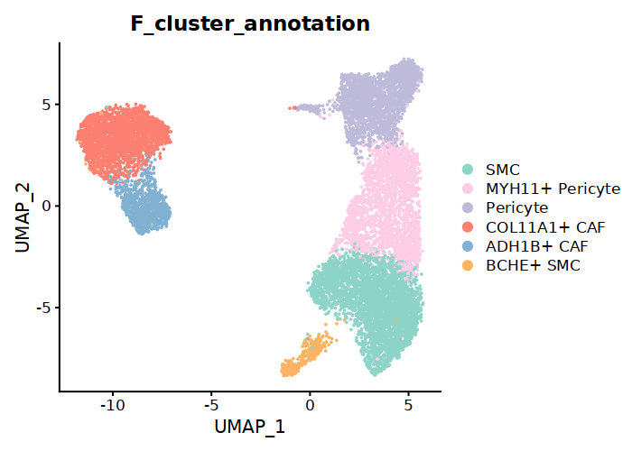
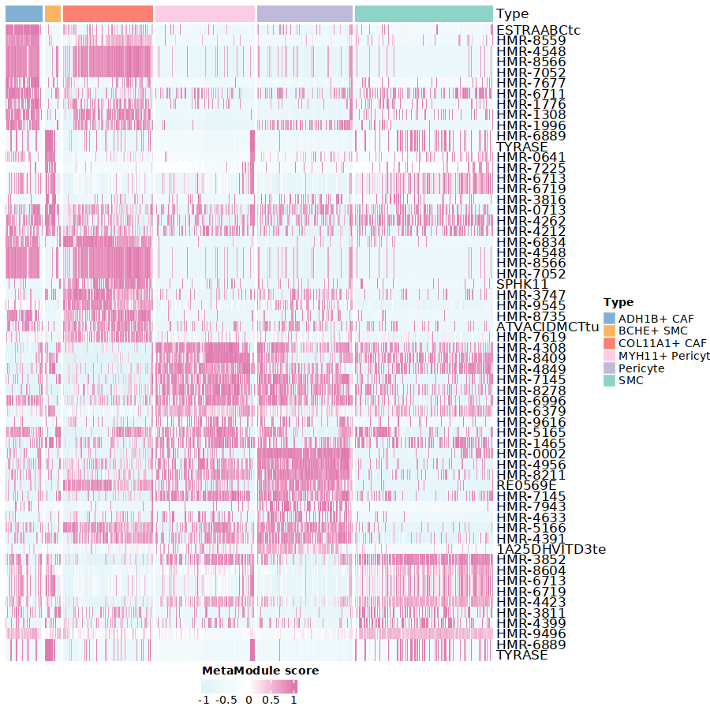
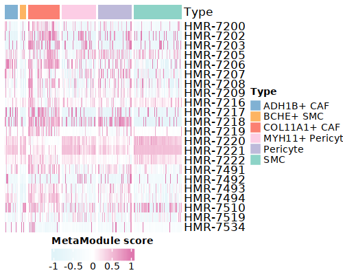
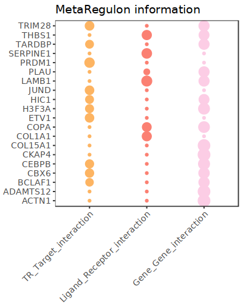
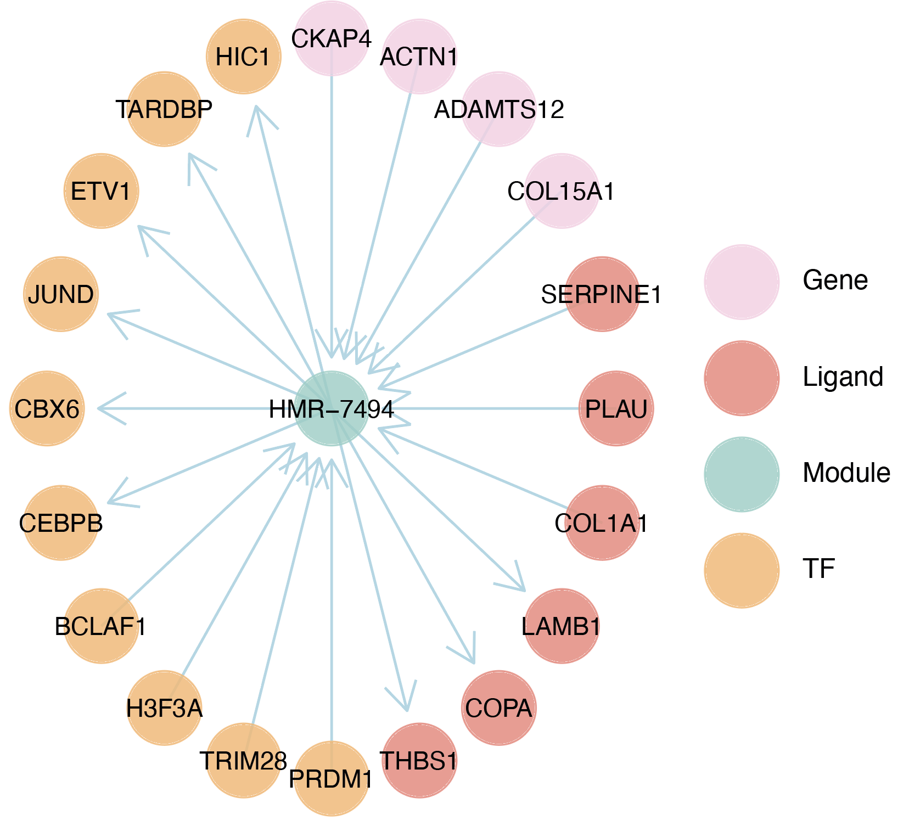

.. highlight:: shell

.. role:: bash(code)
   :language: bash

MetroSCREEN(scRNA-seq)
---------------------------------
For single-cell data, to mitigate the impact of technical noise and increase gene coverage, MetroSCREEN adopts a Metacell strategy similar to `TabulaTIME <https://github.com/wanglabtongji/TabulaTiME>`_. MetroSCREEN calculates the MetaModule score for each Metacell and then builds a MetaRegulon for each dysregulated MetaModule, which provides insights into the mechanisms of metabolic regulation. Besides, MetroSCREEN delineates the direction and source of the MetaRegulon for the MetaModule.

To demonstrate the usage of the MetaModule and MetaRegulon function of MetroSCREEN in bulk scRNA-seq data, we downloaded the dataset from `here <https://zenodo.org/uploads/14160398>`_.

Step 1 Prepare the Metacell
>>>>>>>>>>>>>>>>>>>>>>>>>>>>>>>>>>>>>>>>>>>>>>>>>>>>>>>>>>>>>>>>>>>

MetroSCREEN adopts a Metacell strategy using :bash:`make_Metacell` function. The number of cells in a Metacell depends on the total number of cells. If the total exceeds 3000, the recommended number of cells per Metacell is 30. For smaller cell populations, users can set a lower number of cells per Metacell, but it better not be less than 10.

.. code-block:: r

   library(MetroSCREEN)
   
   Fibro.seurat <- readRDS('./scRNA/fibro_new.rds')
   options(repr.plot.width = 7, repr.plot.height = 5,repr.plot.res = 100)
   DimPlot(Fibro.seurat, reduction = "umap",group.by='F_cluster_annotation',cols=c('SMC'='#8DD3C7','MYH11+ Pericyte'='#FCCDE5','Pericyte'='#BEBADA','COL11A1+ CAF'='#FB8072','ADH1B+ CAF'='#80B1D3','BCHE+ SMC'='#FDB462'))

.. code-block:: r

   ## Set the split with the cell subtypes information
   Fibro.seurat$split=paste0(Fibro.seurat$F_cluster_annotation) 

   ## Construct the Metacell
   make_Metacell(Fibro.seurat,'split',10,'./scRNA/','fibro_new_Metacell') 

   ## Metacell object can be read
   Metacell<-readRDS('./scRNA/fibro_new_Metacell.rds')

   ## The rows of the Metacell are the genes, while the columns of the Metacell are the cell subtypes information. 
   Metacell[1:3,1:6]

   # COL11A1+ CAF|2|1	COL11A1+ CAF|2|2	COL11A1+ CAF|2|3	COL11A1+ CAF|2|4	COL11A1+ CAF|2|5	COL11A1+ CAF|2|6
   # A1BG	0.000000	0.000000	0.000000	0.000000	0.0000000	0.000000
   # A1BG-AS1	0.000000	0.000000	0.000000	0.000000	0.4486995	0.000000
   # A2M	1.658391	1.232226	2.295417	3.266894	2.6936025	3.799514

The results of :bash:`make_Metacell` will be stored in the :bash:`./scRNA/` floder, and the detailed information are shown as below.

+-----------------------------------------------+-------------------------------------------------------------------------------+
| File                                          | Description                                                                   |
+===============================================+===============================================================================+
| ./scRNA/                                      | The directory stores make_Metacell output files.                              |
+-----------------------------------------------+-------------------------------------------------------------------------------+
| {outprefix}.rds                               | The Metacell expression matrix.                                               |
+-----------------------------------------------+-------------------------------------------------------------------------------+
| {outprefix}_info.rds                          | The detailed cell information in a Metacell.                                  |
+-----------------------------------------------+-------------------------------------------------------------------------------+

After obtaining the Metacell object, users can analyze the Metacells expression data in a similar way as with single-cell expression data. 

.. code-block:: r

   ## Create Seurat object for Metacell expression matrix
   Metacell.seurat <- CreateSeuratObject(counts = Metacell, project = "Metacell", min.cells = 0, min.features = 0)

   ## Normalize data
   Metacell.seurat <- NormalizeData(Metacell.seurat)

   ## Find variable features
   Metacell.seurat <- FindVariableFeatures(Metacell.seurat, selection.method = "vst", nfeatures = 2000)

   Metacell.seurat <- ScaleData(Metacell.seurat)
   ## Set the cell subtypes information for seurat object
   Metacell.seurat@meta.data$cell_type=sapply(strsplit(rownames(Metacell.seurat@meta.data),"[|]"), 
                                function(x) x[1])
   Metacell.seurat <- RunPCA(Metacell.seurat)        
   Metacell.seurat <- RunUMAP(Metacell.seurat, dims = 1:10)
   Metacell.seurat <- FindNeighbors(Metacell.seurat, dims = 1:10)
   Metacell.seurat <- FindClusters(Metacell.seurat, resolution = 0.6)
   options(repr.plot.width = 6, repr.plot.height = 5,repr.plot.res = 100)

   DimPlot(Metacell.seurat, reduction = "umap",group.by='cell_type',cols=c('SMC'='#8DD3C7','MYH11+ Pericyte'='#FCCDE5','Pericyte'='#BEBADA','COL11A1+ CAF'='#FB8072','ADH1B+ CAF'='#80B1D3','BCHE+ SMC'='#FDB462'))+ggtitle("Metacell cell subtype")

.. image:: ../_static/img/MetroSCREEN_cell_annotation_Metacell.png
   :width: 50%
   :align: center

If there is a batch effect in the data, it is recommended to construct the Metacells separately for each dataset, and then combine the Metacells. After that, remove the batch effect and proceed with downstream analysis. The recommended workflow for batch effect removal is available in `TabulaTIME <https://github.com/wanglabtongji/TabulaTiME>`_ framework.

Step 2 MetaModule analysis
>>>>>>>>>>>>>>>>>>>>>>>>>>>>>>>>>>>>>>>>

^^^^^^^^^^^^^^^^^^^^^^^^^^^^^^^^^^^^^^^^^^^^^^^^^^^^^^^^
1. Prepare the metabolic information
^^^^^^^^^^^^^^^^^^^^^^^^^^^^^^^^^^^^^^^^^^^^^^^^^^^^^^^^

Here we utilized the metabolic reactions and corresponding information provided by `Recon3D <https://www.nature.com/articles/nbt.4072>`_. Since some of this information is duplicated, we provided a simplified version. Users can download it from `here <https://zenodo.org/uploads/14160223>`_. Alternatively, users can manually create and use gene sets of interest.

.. code-block:: r

   ## Metabolic reactions and detaild description for them
   MM=readRDS("./ref/MM.nodup.rds")
   MM.meta=readRDS("./ref/MM.meta.rds") %>% as.data.frame()
   rownames(MM.meta)=MM.meta$ID

   MM[1:2]
   # $`HMR-0154`
   # 'ACOT7''ACOT2''ACOT9''BAAT''ACOT4''ACOT1''ACOT6'
   # $`HMR-0189`
   # 'ACOT7''ACOT2''BAAT''ACOT4''ACOT1''ACOT6'

   MM.meta[1:3,]
   #	ID	NAME	EQUATION	EC-NUMBER	GENE ASSOCIATION	LOWER BOUND	UPPER BOUND	OBJECTIVE	COMPARTMENT	MIRIAM	SUBSYSTEM	REPLACEMENT ID	NOTE	REFERENCE	CONFIDENCE SCORE
   # <lgl>	<chr>	<chr>	<chr>	<chr>	<chr>	<lgl>	<lgl>	<lgl>	<lgl>	<chr>	<chr>	<lgl>	<lgl>	<chr>	<dbl>
   # HMR-0154	NA	HMR-0154	NA	H2O[c] + propanoyl-CoA[c] => CoA[c] + H+[c] + propanoate[c]       	3.1.2.2	ENSG00000097021 or ENSG00000119673 or ENSG00000123130 or ENSG00000136881 or ENSG00000177465 or ENSG00000184227 or ENSG00000205669	NA	NA	NA	NA	sbo/SBO:0000176	Acyl-CoA hydrolysis	NA	NA	PMID:11013297;PMID:11013297	0
   # HMR-0189	NA	HMR-0189	NA	H2O[c] + lauroyl-CoA[c] => CoA[c] + H+[c] + lauric acid[c]        	3.1.2.2	ENSG00000097021 or ENSG00000119673 or ENSG00000136881 or ENSG00000177465 or ENSG00000184227 or ENSG00000205669                   	NA	NA	NA	NA	sbo/SBO:0000176	Acyl-CoA hydrolysis	NA	NA	NA                         	0
   # HMR-0193	NA	HMR-0193	NA	H2O[c] + tridecanoyl-CoA[c] => CoA[c] + H+[c] + tridecylic acid[c]	3.1.2.2	ENSG00000097021 or ENSG00000119673 or ENSG00000136881 or ENSG00000177465 or ENSG00000184227 or ENSG00000205669                   	NA	NA	NA	NA	sbo/SBO:0000176	Acyl-CoA hydrolysis	NA	NA	NA                         	0

^^^^^^^^^^^^^^^^^^^^^^^^^^^^^^^^^^^^^^^^^^^^^^^^^^^^^^^^
2. Calculate the MetaModule score
^^^^^^^^^^^^^^^^^^^^^^^^^^^^^^^^^^^^^^^^^^^^^^^^^^^^^^^^

In this section, MetroSCREEN calculates the MetaModule score for each Metacell by using :bash:`cal_MetaModule` function. To identify differentially enriched MetaModules for each cell subtypes in the experimental design, the :bash:`FindAllMarkers_MetaModule` function from MetroSCREEN will be used. This function is similar to the  :bash:`FindAllMarkers` function in `Seurat <https://satijalab.org/seurat/>`_, allowing users to use similar parameters. The results of :bash:`cal_MetaModule` will be stored in the :bash:`./scRNA/` folder.

.. code-block:: r

   ## Calculate the MetaModule score
   cal_MetaModule(Metacell,MM,'./scRNA/','fibro_new_Metacell_gsva')
   Metacell.gsva=readRDS("./scRNA/fibro_new_Metacell_gsva.rds")

^^^^^^^^^^^^^^^^^^^^^^^^^^^^^^^^^^^^^^^^^^^^^^^^^^^^^^^^
3.  MetaModule score exploration
^^^^^^^^^^^^^^^^^^^^^^^^^^^^^^^^^^^^^^^^^^^^^^^^^^^^^^^^

.. code-block:: r

   ## Construct the Metacell information
   sample_info=as.factor(Metacell.seurat$cell_type)
   names(sample_info)=colnames(Metacell.seurat)

   ## Find the differentially enriched MetaModule for each cell subtype in a dataset
   MetaModule.markers=FindAllMarkers_MetaModule(Metacell.gsva,sample_info,'scRNA')  
   MetaModule.markers=MetaModule.markers[MetaModule.markers$p_val_adj<0.05,]

   ## Add metabolic information for the differentially enriched MetaModule
   MetaModule.markers$metabolic_type=MM.meta[MetaModule.markers$gene,'SUBSYSTEM']
   MetaModule.markers$reaction=MM.meta[MetaModule.markers$gene,'EQUATION']

   head(MetaModule.markers)

   # p_val	avg_log2FC	pct.1	pct.2	p_val_adj	cluster	gene	metabolic_type	reaction
   # <dbl>	<dbl>	<dbl>	<dbl>	<dbl>	<fct>	<chr>	<chr>	<chr>
   # ESTRAABCtc	1.427178e-49	1.5298256	0.927	0.159	2.239243e-46	ADH1B+ CAF	ESTRAABCtc	Transport reactions  	ATP[c] + estradiol-17beta 3-glucuronide[s] + H2O[c] => ADP[c] + estradiol-17beta 3-glucuronide[c] + H+[c] + Pi[c]
   # HMR-8559	2.857953e-41	1.2123590	0.917	0.224	4.484128e-38	ADH1B+ CAF	HMR-8559  	Eicosanoid metabolism	prostaglandin D2[r] <=> prostaglandin H2[r]                                                                      
   # HMR-9514	3.597369e-36	0.7508997	0.906	0.338	5.644273e-33	ADH1B+ CAF	HMR-9514  	Isolated             	NADPH[c] + O2[c] + trimethylamine[c] => H2O[c] + NADP+[c] + trimethylamine-N-oxide[c]                    

   saveRDS(MetaModule.markers,'./scRNA/fibro_new_Metacell_gsva_markers.rds')

^^^^^^^^^^^^^^^^^^^^^^^^^^^^^^^^^^^^^^^^^^^^^^^^^^^^^^^^
4. Visualization
^^^^^^^^^^^^^^^^^^^^^^^^^^^^^^^^^^^^^^^^^^^^^^^^^^^^^^^^

Here, we give two examples for the following analysis, users can also explore more by add the MetaModule score to the :bash:`meta.data` slot of the :bash:`Metacell.seurat` object.

.. code-block:: r

   ## Show the top 10 most enriched MetaModule for each cell subtype
   top10<- MetaModule.markers %>%
      group_by(cluster) %>%
      arrange(desc(avg_log2FC), .by_group = TRUE) %>%
      slice_head(n = 10) %>%
      ungroup() 

   doheatmap_feature(Metacell.gsva,sample_info,top10$gene,9,9,cols=c('SMC'='#8DD3C7','MYH11+ Pericyte'='#FCCDE5','Pericyte'='#BEBADA','COL11A1+ CAF'='#FB8072','ADH1B+ CAF'='#80B1D3','BCHE+ SMC'='#FDB462'))

In our fibroblast integration data, we found that CTHRC1+ CAFs showed higher MetaModule scores for chondroitin sulfate biosynthesis (HMR_7493 and HMR_7494). In this dataset, COL11A1+ CAFs exhibited a similar pattern.

.. code-block:: r

   doheatmap_feature(Metacell.gsva.seurat,'cell_type',MM.meta[MM.meta$SUBSYSTEM=='Chondroitin / heparan sulfate biosynthesis','ID'],5,4, cols=c('SMC'='#8DD3C7','MYH11+ Pericyte'='#FCCDE5','Pericyte'='#BEBADA','COL11A1+ CAF'='#FB8072','ADH1B+ CAF'='#80B1D3','BCHE+ SMC'='#FDB462'))

   
Step 3 MetaRegulon analysis
>>>>>>>>>>>>>>>>>>>>>>>>>>>>>>>>>>>>>>>>

MetroSCREEN systematically considers the combined effects of intrinsic cellular drivers and extrinsic environmental factors of metabolic regulation.

^^^^^^^^^^^^^^^^^^^^^^^^^^^^^^^^^^^^^^^^^^^^^^^^^^^^^^^^
1. Prepare the essential files
^^^^^^^^^^^^^^^^^^^^^^^^^^^^^^^^^^^^^^^^^^^^^^^^^^^^^^^^

Find the marker genes for each cell subtype, this is the basis for MetaRegulon activity calculation.

.. code-block:: r

   ## Find the marker genes for each cell subtype of the Metacell object
   Metacell.seurat<-readRDS('./scRNA/fibro_new_Metacell_seurat.rds')
   Metacell.seurat.markers <- FindAllMarkers(Metacell.seurat, only.pos = TRUE)
   Metacell.seurat.markers=Metacell.seurat.markers[Metacell.seurat.markers$p_val_adj<0.05,]
   Metacell.seurat.markers=Metacell.seurat.markers[order(Metacell.seurat.markers$avg_log2FC,decreasing = TRUE),]
   saveRDS(Metacell.seurat.markers,'./scRNA/fibro_new_Metacell_gene_markers.rds')

Prepare the Lisa results for each group. This is the basis for MetaRegulon TR activity calculation. Users can known more about Lisa `here <https://genomebiology.biomedcentral.com/articles/10.1186/s13059-020-1934-6>`_.

.. code-block:: r

   for (i in unique(Metacell.seurat.markers$cluster)){
      df=Metacell.seurat.markers[Metacell.seurat.markers$cluster==i,]
      if (nrow(df)>500){
         genes=df[,'gene'][1:500]
      } else{
         genes=df[,'gene']
      }
      
      write.table(genes,paste0('./scRNA/lisa/',i,':marker.txt'),
            sep='\t',
            quote=F,
            row.names=FALSE,
            col.names=FALSE)
   }

::

   ## Run this under Lisa's guidance
   lisa multi hg38 ./scRNA/lisa/*.txt -b 501 -o ./scRNA/lisa/

^^^^^^^^^^^^^^^^^^^^^^^^^^^^^^^^^^^^^^^^^^^^^^^^^^^^^^^^
2. Calculate the MetaRegulon score
^^^^^^^^^^^^^^^^^^^^^^^^^^^^^^^^^^^^^^^^^^^^^^^^^^^^^^^^

The MetaRegulon for MetaModule can be inferred by :bash:`cal_MetaRegulon` function. MetroSCREEN used a four-step strategy to infer the MetaRegulon.
The first step is to infer the activity of the MetaRegulon.

The second step involves correlating MetaRegulon activity with the expression of genes within MetaModule. We consider the highest correlation value among the genes in a MetaModule to represent the interaction between the MetaRegulon and the MetaModule. 

The third step involves a multi-objective optimization method to determine which MetaRegulon is most likely to control the MetaModule.

The fourth step involves inferring causation between the MetaModule and MetaRegulon by using PC based method.

.. code-block:: r

   ## Users can replace the metabolic reaction with one they are interested in
   MM=readRDS("./ref/MM.nodup.rds")
   MM.meta=readRDS("./ref/MM.meta.rds") %>%
      as.data.frame()
   rownames(MM.meta)=MM.meta$ID

   MetaModule.markers<-readRDS('./scRNA/fibro_new_Metacell_gsva_markers.rds')
   Metacell.seurat<-readRDS('./scRNA/fibro_new_Metacell_seurat.rds')
   Metacell.seurat.markers<-readRDS('./scRNA/fibro_new_Metacell_gene_markers.rds')

   ## set the parameters
   object=Metacell.seurat
   feature='cell_type'
   state='COL11A1+ CAF'
   ## Users can use the differentially enriched MetaModule
   # interested_MM=MetaModule.markers[MetaModule.markers$cluster=='COL11A1+ CAF','gene']
   interested_MM=c('HMR-7493','HMR-7494')
   MM_list=MM
   markers=Metacell.seurat.markers
   lisa_file='./scRNA/lisa/COL11A1+ CAF:marker.txt.lisa.tsv'
   ligand_target_matrix='./ref/ligand_target_matrix.rds'
   lr_network='./ref/lr_network.rds'
   sample_tech='scRNA'
   output_path='./scRNA/'
   RP_score='./ref/RP_score.rds'
   file_name='COL11A1_CAF'

Calculate the MetaRegulon score

.. code-block:: r

   cal_MetaRegulon(object,feature,state,interested_MM,MM_list,markers,lisa_file,ligand_target_matrix,lr_network,sample_tech,output_path,RP_score,file_name)

The results of :bash:`cal_MetaRegulon` will be stored in the :bash:`./scRNA/COL11A1_CAF/` floder, and the detailed information are shown as below.

+-----------------------------------------------------------------------------------------------------------------------------------+
| File                                          | Description                                                                       |
+===============================================+===================================================================================+
| {file_name}.rds                               | The expression matrix of the state.                                               |
+-----------------------------------------------+-----------------------------------------------------------------------------------+
| {file_name}:lr_activity.rds                   | The ligands activity for each Metacell.                                           |
+-----------------------------------------------+-----------------------------------------------------------------------------------+
| {file_name}:tr_activity.rds                   | The transcriptional regulators activity for each Metacell.                        |
+-----------------------------------------------+-----------------------------------------------------------------------------------+
| {file_name}:gg_activity_cor.rds               | The correlation of intrinsic signaling components activity with MetaModule.       |
+-----------------------------------------------+-----------------------------------------------------------------------------------+
| {file_name}:tr_activity_cor.rds               | The correlation of intrinsic transcriptional regulators activity with MetaModule. |                
+-----------------------------------------------+-----------------------------------------------------------------------------------+
| {file_name}:lr_activity_cor.rds               | The correlation of extrinsic ligands activity with MetaModule.                    |
+-----------------------------------------------+-----------------------------------------------------------------------------------+
| ./MetaRegulon/{file_name}:*.txt               | The MetaRegulon results.                                                          |
+-----------------------------------------------+-----------------------------------------------------------------------------------+

^^^^^^^^^^^^^^^^^^^^^^^^^^^^^^^^^^^^^^^^^^^^^^^^^^^^^^^^
3. Downstream analysis
^^^^^^^^^^^^^^^^^^^^^^^^^^^^^^^^^^^^^^^^^^^^^^^^^^^^^^^^

Resources of the MetaRegulon.

.. code-block:: r

   hmr_7494<-read.csv(paste0(output_path,file_name,'/MetaRegulon/',file_name,':HMR-7494.txt'),row.names = 1)
   head(hmr_7494,2)
   # TR_Target_interaction	Ligand_Receptor_interaction	Gene_Gene_interaction	ag_score	.level	Final_score	gene	rank	resource	direction
   # <dbl>	<dbl>	<dbl>	<dbl>	<int>	<dbl>	<chr>	<int>	<chr>	<chr>
   # CKAP4	0	0.000000	0.4888826	0.02205261	1	0.02205261	CKAP4	1	intrinsic	regulator
   # LAMB1	0	0.312634	0.3241996	0.02205261	1	0.02205261	LAMB1	2	intrinsic	effector
   df_use=melt(hmr_7494[1:20,c(1:3,7)])

   width=4
   height=5
   options(repr.plot.width =width, repr.plot.height = height,repr.plot.res = 100)
   ggplot(df_use, aes(x = variable, y = gene)) +
      geom_point(aes(color = variable, size = value)) +
      scale_color_manual(values = c("TR_Target_interaction" = "#FDB462", "Ligand_Receptor_interaction" = "#FB8072",'Gene_Gene_interaction'='#FCCDE5')) + 
      theme_bw() +
      theme(
         panel.grid.major = element_blank(),
         panel.grid.minor = element_blank(),
         axis.text.x = element_text(angle = 45, hjust = 1),
         legend.position = "none"
      ) +
      theme(axis.title = element_text(size = 10), axis.text = element_text(size = 10), 
            legend.text = element_text(size = 10), legend.title = element_text(size = 10))+
      labs(x = NULL, y = NULL, title = "MetaRegulon information")

Build the network.

.. code-block:: r

   hmr_7494<-read.csv(paste0(output_path,file_name,'/MetaRegulon/',file_name,':HMR-7494.txt'),row.names = 1)
   df_use=hmr_7494[1:20,]
   network=data.frame(from=rownames(df_use),to='HMR-7494',label=ifelse(df_use$direction=='regulator','1','2'),
                     color=ifelse(df_use$gene %in% df_use[df_use$Ligand_Receptor_interaction>0,'gene'],'Ligand',
                                 ifelse(df_use$gene %in% df_use[df_use$TR_Target_interaction>0,'gene'],'TF','Gene')))
   network <- network %>%
      mutate(
         from_new = ifelse(label == 2, to, from),
         to_new = ifelse(label == 2, from, to)
      ) %>%
      select(from = from_new, to = to_new, label, color)
   node=data.frame(unique(c(network$from,network$to)))
   node$class=ifelse(node[,1] %in% 'HMR-7494','Module',
                     ifelse(node[,1] %in% df_use[df_use$Ligand_Receptor_interaction>0,'gene'],'Ligand',
                        ifelse(node[,1] %in% df_use[df_use$TR_Target_interaction>0,'gene'],'TF','Gene')))
   colnames(node)=c('gene','class')
   g <- graph_from_data_frame(d = network, vertices =node, directed = TRUE)
   layout <- create_layout(g, layout = 'circle')

   ## Modify the layout 
   n=nrow(layout[layout$class %in% c('Ligand','TF'),c('x','y')])
   theta <- seq(0,2*pi, length.out = 21) 
   coords <- data.frame(
   x = sin(theta) , 
   y =  cos(theta) )
   layout[layout$class=='Gene',c('x','y')]=coords[1:4,]
   layout[layout$class=='Ligand',c('x','y')]=coords[5:10,]
   layout[layout$class=='TF',c('x','y')]=coords[11:20,]
   layout[layout$class=='Module','x']=0
   layout[layout$class=='Module','y']=0

Draw the network

.. code-block:: r

   width=5
   height=5
   options(repr.plot.width =width, repr.plot.height = height,repr.plot.res = 100)
   output_name='HMR-7493.pdf'

   graph_g<-ggraph(layout)+   #kk
      geom_edge_link(color='lightblue',arrow = arrow(length = unit(5, 'mm')),end_cap = circle(8, 'mm'))+
      geom_node_point(aes(color=class),size = 15,alpha=0.8)+
      geom_node_text(aes(label = name),size=4) +
      scale_color_manual(values = c('Ligand'="#FB8072",'TF'="#FDB462",'Gene'='#FCCDE5','Module'='#8DD3C7')) +
      scale_edge_width(range=c(0.5,1.5))+
      theme(text = element_text(size=8))+
      theme_void()
   print(graph_g)
   pdf(paste0(output_path,output_name),width=width,height=height)
      print(graph_g) 
   dev.off()

